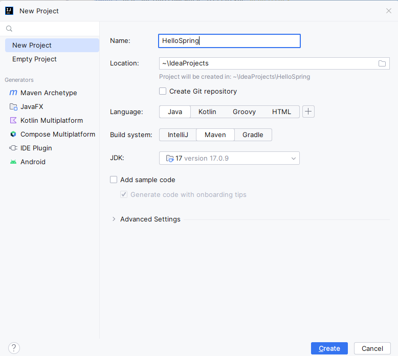

# QUICKSTART

This quickstart is to show how we can add a bean to the Spring Context.

## STEPS

- Create a simple maven project with a Main method to get started.



- Add the maven dependency for spring context

```xml
<dependency>
    <groupId>org.springframework</groupId>
    <artifactId>spring-context</artifactId>
    <version>6.1.1</version>
</dependency>
```

- Let us create a Parrot class. We will be using this to create a bean that needs to be stored in the Spring Context so that it can be managed by the Spring Framework.

```java
package main;

public class Parrot {

    private String name;

    public String getName() {
        return name;
    }

    public void setName(String name) {
        this.name = name;
    }
}
```

- Next, we define a `@Configuration` class. One of the things you can do with a configuration class is add beans to the Spring context. To do this, we need to define a method that returns the object instance we wish to add to the context and annotate that method with the @Bean annotation, which lets Spring know that it needs to call this method when it initializes its context and adds the returned value to the context.

```java
package config;

import main.Parrot;
import org.springframework.context.annotation.Bean;
import org.springframework.context.annotation.Configuration;

@Configuration
public class ProjectConfig {

    @Bean
    Parrot parrot(){
        Parrot p = new Parrot();
        p.setName("Koko");
        return p;
    }

}
```

Observe that the name I used for the method doesn’t contain a verb. The method’s name also becomes the bean’s name.

- Finally, we will use `AnnotationConfigApplicationContext` class to let Spring initialize its context using the Configuration class we created. Then, we can get the required bean from this context.

```java
package main;

import config.ProjectConfig;
import org.springframework.context.annotation.AnnotationConfigApplicationContext;

public class Main {

    public static void main(String[] args) {

        var context = new AnnotationConfigApplicationContext(ProjectConfig.class);
        Parrot p = context.getBean(Parrot.class);

        System.out.println(p.getName());


    }

}
```
