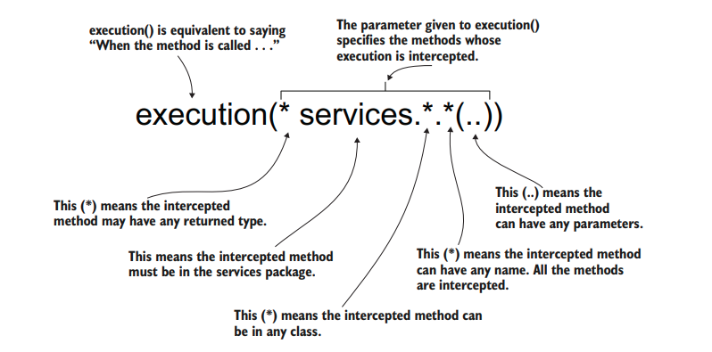

# USING ASPECTS WITH SPRING ASPECT ORIENTED PROGRAMMING (AOP)

Aspects are a way the framework intercepts method calls and possibly alters the execution of methods.

When designing an aspect, you define the following:

- _What_ code you want Spring to execute when you call specific methods. This is
  named an _aspect_.
- _When_ the app should execute this logic of the aspect (e.g., before or after the
  method call, instead of the method call). This is named the _advice_.
- _Which_ methods the framework needs to intercept and execute the aspect for
  them. This is named a _pointcut_

> We want _some logic_ (the aspect) to be executed _before_ (the advice) each _execution_ (the joint point) of _method publishComment()_ (the pointcut), which belongs to _the CommentService bean_ (the target object).

When we use aspects, we do not directly call the actual bean's methods. Instead, spring gives us a "proxy" object. When we call the aspected method, it actually goes through this proxy object. The proxy applies the aspect logic and delegates the call to the actual method.

## GETTING STARTED

We will make use of a `CommentService`, which has a `publishComment()` method. The requirement is to add a log before and after each execution of any of the methods in the service(s). We will achieve this using aspects.

First, we need to add the following dependencies to pom.xml

```xml
<dependency>
    <groupId>org.springframework</groupId>
    <artifactId>spring-context</artifactId>
    <version>6.1.1</version>
</dependency>
<dependency>
    <groupId>org.springframework</groupId>
    <artifactId>spring-aspects</artifactId>
    <version>6.1.1</version>
</dependency>
```

Now, we will get the classes ready (without aspects). First the model class `Comment`:

```java
package models;

public class Comment {

    private String author;
    private String text;

    public String getAuthor() {
        return author;
    }

    public void setAuthor(String author) {
        this.author = author;
    }

    public String getText() {
        return text;
    }

    public void setText(String text) {
        this.text = text;
    }
}
```

To keep things simple, we will only keep the `CommentService` class for the use case. This uses the Java API logging to log a message which includes the class name from which this gets logged.

```java
package services;

import models.Comment;
import org.springframework.stereotype.Service;

import java.util.logging.Logger;

@Service
public class CommentService {

    private Logger logger = Logger.getLogger(CommentService.class.getName());

    public void publishComment(Comment comment){
        logger.info("publishing comment: " + comment.getText() + " by " + comment.getAuthor());
    }

}
```

Let's run the main app, which currently does not use aspects:

```java
package main;

import config.AppConfig;
import models.Comment;
import org.springframework.context.annotation.AnnotationConfigApplicationContext;
import services.CommentService;

public class App {

    public static void main(String[] args) {

        var context = new AnnotationConfigApplicationContext(AppConfig.class);

        Comment comment = new Comment();
        comment.setAuthor("Scooby");
        comment.setText("Scooby Dooby Doo!");
        CommentService commentService = context.getBean(CommentService.class);

        commentService.publishComment(comment);

    }

}
```

OUTPUT:

```text
Dec 22, 2023 11:25:07 PM services.CommentService publishComment
INFO: publishing comment: Scooby Dooby Doo! by Scooby
```

## ADDING ASPECT TO OUR APP

- Enable the aspect mechanism in the Spring app by annotating the configuration class with the `@EnableAspectJAutoProxy` annotation.

  ```java
  package config;

  import org.springframework.context.annotation.ComponentScan;
  import org.springframework.context.annotation.Configuration;
  import org.springframework.context.annotation.EnableAspectJAutoProxy;

  @Configuration
  @ComponentScan(basePackages = {"services","aspects"})
  @EnableAspectJAutoProxy
  public class AppConfig {
  }
  ```

- Create a new class, and annotate it with the `@Aspect` annotation. Using either
  `@Bean` or stereotype annotations, add a bean for this class in the Spring context.

  ```java
  package aspects;

  import org.aspectj.lang.annotation.Aspect;
  import org.springframework.stereotype.Component;

  @Aspect
  @Component
  public class LoggingAspect {

      public void log(){
          // To implement later
      }

  }
  ```

  > IMPORTANT: Remember, you need to make this object a bean in the Spring context because Spring needs to know about any object it needs to manage.

- Define a method that will implement the aspect logic and tell Spring when and
  which methods to intercept using an advice annotation

  ```java
  package aspects;

  import org.aspectj.lang.ProceedingJoinPoint;
  import org.aspectj.lang.annotation.Around;
  import org.aspectj.lang.annotation.Aspect;
  import org.springframework.stereotype.Component;

  import java.util.logging.Logger;

  @Aspect
  @Component
  public class LoggingAspect {

      private Logger logger = Logger.getLogger(LoggingAspect.class.getName());

      @Around("execution(* services.*.*(..))")
      public void log(ProceedingJoinPoint joinPoint) throws Throwable {
          logger.info("starting execution");
          joinPoint.proceed();
          logger.info("execution complete");
      }

  }
  ```

  The pointcut expression `execution(* services.*.*(..))` means:

  "Apply this advice around the execution of any method with any return type within any class in the services package, regardless of the method name and with any parameters."

  

  Check AspectJ for more info: [@AspectJ](https://docs.spring.io/spring-framework/reference/core/aop/ataspectj.html)

- Let's run the app!

  ```java
  package main;

  import config.AppConfig;
  import models.Comment;
  import org.springframework.context.annotation.AnnotationConfigApplicationContext;
  import services.CommentService;

  public class App {

      public static void main(String[] args) {

          var context = new AnnotationConfigApplicationContext(AppConfig.class);

          Comment comment = new Comment();
          comment.setAuthor("Scooby");
          comment.setText("Scooby Dooby Doo!");
          CommentService commentService = context.getBean(CommentService.class);

          commentService.publishComment(comment);

      }

  }
  ```

  OUTPUT:

  ```java
    Dec 22, 2023 11:43:38 PM aspects.LoggingAspect log
    INFO: starting execution
    Dec 22, 2023 11:43:38 PM services.CommentService publishComment
    INFO: publishing comment: Scooby Dooby Doo! by Scooby
    Dec 22, 2023 11:43:38 PM aspects.LoggingAspect log
    INFO: execution complete
  ```

  Magically, the aspect method that we created intercepts the call and handles the execution. The method `joinPoint.proceed()` actually delegates the call to the real method. If we did not add it, it wouldn't have executed the `publishComment()` method at all!
