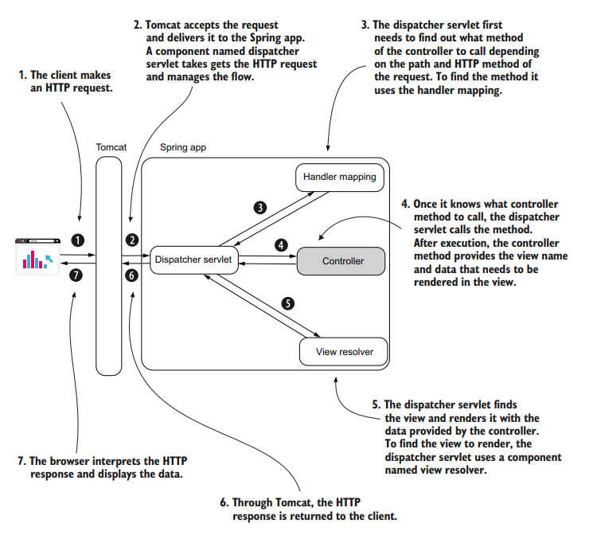

# GETTING STARTED WITH SPRING MVC AND SPRING BOOT



## Spring MVC flow

- The client sends an HTTP request to the web server.
- The dispatcher servlet uses the handler mapping to find out what controller
  action to call.
- The dispatcher servlet calls the controller's action.
- After executing the action associated with the HTTP request, the controller
  returns the view name the dispatcher servlet needs to render into the HTTP
  response.
- The response is sent back to the client.

## A SIMPLE APP

- Use [https://start.spring.io/](https://start.spring.io/) to create a Spring Boot app and add the `Spring Web` dependency.

- Create a simple `home.html` under `resources/static` folder

```html
<!DOCTYPE html>
<html lang="en">
  <head>
    <meta charset="UTF-8" />
    <title>Hello Spring</title>
  </head>
  <body>
    <h1>Hello, from Spring!</h1>
  </body>
</html>
```

- Create a Controller:

```java
package com.example.demo;

import org.springframework.stereotype.Controller;
import org.springframework.web.bind.annotation.RequestMapping;

@Controller
public class MainController {

    @RequestMapping("/home")
    public String home(){
        return "home.html";
    }

}
```

- Start the Spring Boot App and access: [http://localhost:8080/home](http://localhost:8080/home). You should be able to see the home.html page.
