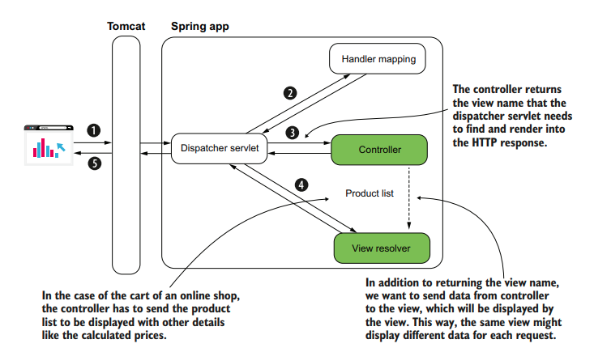
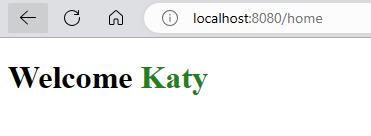
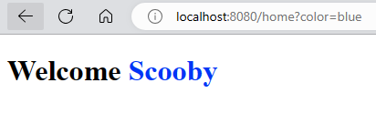
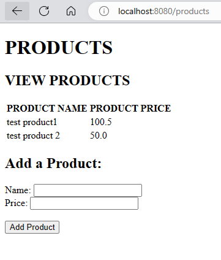

# CREATING DYNAMIC PAGE USING THYMELEAF

In the previous example, we create a simple Web Application using Spring Boot which return a static HTML page. Most applications today are dynamic. In this example, we will use a `template engine` called `Thymeleaf` to create dynamic content in Spring Boot.



## DEPENDENCY

To use Thymeleaf, we would need to following dependency in pom.xml:

```xml
<dependency>
    <groupId>org.springframework.boot</groupId>
    <artifactId>spring-boot-starter-thymeleaf</artifactId>
</dependency>
```

- Create a `home.html` file under `resources/templates` (not resources/static) like below:

```html
<!DOCTYPE html>
<html lang="en" xmlns:th="http://www.thymeleaf.org">
  <head>
    <meta charset="UTF-8" />
    <title>Hello Spring</title>
  </head>
  <body>
    <h1>
      Welcome <span th:style="'color:' + ${color}" th:text="${username}"></span>
    </h1>
  </body>
</html>
```

Here we have used a namespace for thymeleaf `xmlns:th="http://www.thymeleaf.org"`. This is similar to import statements in Java.

- Create a controller to handle requests to /home. We also add a parameter `Model`. We can add attributes to this model object as key-value pairs. This will be passed on to the view for rendering. Notice that we have use these keys `username` and `color` in the HTML template.

```java
package com.example.demo;

import org.springframework.stereotype.Controller;
import org.springframework.ui.Model;
import org.springframework.web.bind.annotation.RequestMapping;

@Controller
public class MainController {

    @RequestMapping("/home")
    public String home(Model model){

        model.addAttribute("username", "Katy");
        model.addAttribute("color", "green");

        return "home.html";
    }

}
```

Test the app:



## PROCESS DATA THROUGH HTTP REQUEST

There are multiple ways in which clients can send data to the server:

- HTTP request parameters (query parameters) transmit data as key-value pairs appended to the URI, suitable for sending small amounts of data:

  Example: `https://example.com/api/resource?param1=value1&param2=value2`

- HTTP request headers also convey data, but they are transmitted within the HTTP header and don't appear in the URI. They're suitable for sending limited data, similar to request parameters.

- Path variables embed data within the request path itself. They're ideal for mandatory data and are suitable for sending smaller amounts of information:

  Example: `https://example.com/api/resource/{id}`

- HTTP request bodies are used for larger data payloads, often in string or binary formats (such as files), and are ideal for transmitting substantial amounts of data.

  Example (JSON):

  ```json
  {
    "key1": "value1",
    "key2": "value2"
  }
  ```

### USING HTTP REQUEST PARAMETERS (QUERY PARAMETERS)

In the controller, we will need to add another annotation `@RequestParam` so get the value from request parameter.

```java
@RequestMapping("/home")
public String home(@RequestParam String color, Model model){

    model.addAttribute("username", "Scooby");
    model.addAttribute("color", color);

    return "home.html";
}
```

> If we directly access `http://localhost:8080/home` now, we will get HTTP 400 (Bad Request). A request parameter is mandatory by default. If the client doesn’t provide a value for it, the server sends back a response with the status HTTP "400 Bad Request." If you wish the value to be optional, you need to explicitly specify this on the annotation using the optional attribute: `@RequestParam(optional=true)`



We can use multiple request parameters as well:

```java
@RequestMapping("/home")
public String home(@RequestParam String name, @RequestParam String color, Model model){

    model.addAttribute("username", name);
    model.addAttribute("color", color);

    return "home.html";
}
```

Test using: `http://localhost:8080/home?name=Kevin&color=orange`

### USING PATH VARIABLES

When the page you write depends on only one or two values that are the core of the
end result, it’s better to write them directly in the path to make the request easier to read. The URL is also easier to find when you bookmark it in your browser and easier to index with a search engine. If there are many parameters which need to be passed, it would be better to use query parameters.

Here's an example:

We refer to the path via: `@RequestMapping("/home/{color}")`, then use it using `@PathVariable String color`

```java
@RequestMapping("/home/{color}")
public String home(@PathVariable String color, Model model){

    model.addAttribute("username", "Katy");
    model.addAttribute("color", color);

    return "home.html";
}
```

We can test this using via `http://localhost:8080/home/blue`, `http://localhost:8080/home/green` etc.

### USING HTTP GET AND POST METHODS

Common HTTP methods:

| HTTP Method | Description                                                              |
| ----------- | ------------------------------------------------------------------------ |
| GET         | The client’s request only retrieves data.                                |
| POST        | The client’s request sends new data to be added by the server.           |
| PUT         | The client’s request changes a data record on the server side.           |
| PATCH       | The client’s request partially changes a data record on the server side. |
| DELETE      | The client’s request deletes data on the server side.                    |

We will create a simple web application in which clients can add and view `Product`. We will have a HTML form which can send data to be added. It will also show a list of Products currently present.

Let's start by creating our model class for `Product`:

```java
package com.example.demo.model;

public class Product {

    private String name;
    private double price;

    public String getName() {
        return name;
    }

    public void setName(String name) {
        this.name = name;
    }

    public double getPrice() {
        return price;
    }

    public void setPrice(double price) {
        this.price = price;
    }
}
```

We will use this in the `ProductService` class. We are not really following the best practices here. And remember that by default the scope will be singleton for the service as well. So it's not thread-safe.

```java
package com.example.demo.service;

import com.example.demo.model.Product;
import org.springframework.stereotype.Service;

import java.util.ArrayList;
import java.util.List;

@Service
public class ProductService {

    private List<Product> products = new ArrayList<>();

    public List<Product> findAll(){
        return products;
    }

    public void addProduct(Product product){
        products.add(product);
    }

}
```

We can now write our Controller which will make use of the `ProductService` to add or view products. It will have two methods, one for HTTP GET and another for HTTP POST. To allow the view to show the products, we will add list of products to the `Model`.

```java
package com.example.demo.controller;


import com.example.demo.model.Product;
import com.example.demo.service.ProductService;
import org.springframework.stereotype.Controller;
import org.springframework.ui.Model;
import org.springframework.web.bind.annotation.GetMapping;
import org.springframework.web.bind.annotation.PostMapping;
import org.springframework.web.bind.annotation.RequestParam;

import java.util.List;

@Controller
public class ProductController {

    private final ProductService productService;

    public ProductController(ProductService productService){ //DI
        this.productService = productService;
    }

    @GetMapping("/products")
    public String viewProducts(Model model){

        List<Product> products = productService.findAll();
        model.addAttribute("products", products);

        return "products.html";
    }

    @PostMapping("/products")
    public String addProduct(@RequestParam String name, @RequestParam double price, Model model){

        Product product = new Product();
        product.setName(name);
        product.setPrice(price);

        productService.addProduct(product);

        List<Product> products = productService.findAll();
        model.addAttribute("products", products);

        return "products.html";

    }

}

```

Finally, we can create our view which will use the attribute added to the `Model` earlier to show the list of products. We have also created a HTML form which will send HTTP POST request and add two parameters while sending this request - name and price. This will be handled by the HTTP POST controller we created in `ProductController`.

```html
<!DOCTYPE html>
<html lang="en" xmlns:th="http://www.thymeleaf.org">
  <head>
    <meta charset="UTF-8" />
    <title>Home Page</title>
  </head>
  <body>
    <h1>PRODUCTS</h1>

    <h2>VIEW PRODUCTS</h2>

    <table>
      <tr>
        <th>PRODUCT NAME</th>
        <th>PRODUCT PRICE</th>
      </tr>

      <tr th:each="p: ${products}">
        <td th:text="${p.name}"></td>
        <td th:text="${p.price}"></td>
      </tr>
    </table>

    <h2>Add a Product:</h2>
    <form method="POST" action="/products">
      Name: <input type="text" name="name" />
      <br />
      Price: <input type="number" step="any" name="price" /> <br /><br />

      <button type="submit">Add Product</button>
    </form>
  </body>
</html>
<!DOCTYPE html>
<html lang="en" xmlns:th="http://www.thymeleaf.org">
  <head>
    <meta charset="UTF-8" />
    <title>Home Page</title>
  </head>
  <body>
    <h1>PRODUCTS</h1>

    <h2>VIEW PRODUCTS</h2>

    <table>
      <tr>
        <th>PRODUCT NAME</th>
        <th>PRODUCT PRICE</th>
      </tr>

      <tr th:each="p: ${products}">
        <td th:text="${p.name}"></td>
        <td th:text="${p.price}"></td>
      </tr>
    </table>

    <h2>Add a Product:</h2>
    <form method="POST" action="/products">
      Name: <input type="text" name="name" />
      <br />
      Price: <input type="number" step="any" name="price" /> <br /><br />

      <button type="submit">Add Product</button>
    </form>
  </body>
</html>
```

Let's run!


