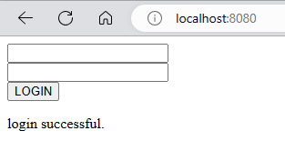

# SPRING WEB SCOPES

Previously we have looked at Singleton and Prototype bean scopes. There are certain scopes meant only for web application. These are:

- Request scope—Spring creates an instance of the bean class for every HTTP
  request. The instance exists only for that specific HTTP request.
- Session scope—Spring creates an instance and keeps the instance in the server's
  memory for the full HTTP session. Spring links the instance in the context with
  the client's session.
- Application scope—The instance is unique in the app's context, and it's available while the app is running

We will understand these with an app which has a login functionlity. The user would enter the credentials. This will be validated only for that particular request using request scope. We will keep that user logged in for a certain duration using session scope. Using application scope, we will maintain a count of logins by all the users.

## REQUEST SCOPE

A request-scoped bean is an object managed by Spring, for which the framework
creates a new instance for every HTTP request. The app can use the instance only for the request that created it. Any new HTTP request (from the same or other clients) creates and uses a different instance of the same class.

Let's create a HTML form which the user can use to submit their credentials. A message will be displayed depending on the validity. We will use a `LoginProcessor` which will help with validation of user credentials. This class will be `@RequestScope`, so spring should create a bean for each HTTP request. We also need to mark it with `@Component` (or use `@Bean`) so that it can be managed by spring. First, `login.html`:

```html
<!DOCTYPE html>
<html lang="en" xmlns:th="http://www.thymeleaf.org">
  <head>
    <meta charset="UTF-8" />
    <title>Home page</title>
  </head>
  <body>
    <form action="/" method="post">
      <input type="text" name="username" />
      <br />
      <input type="text" name="password" />
      <br />
      <button type="submit">LOGIN</button>
    </form>

    <p th:text="${message}"></p>
  </body>
</html>
```

Let's now created the request scoped `LoginProcessor`:

```java
package com.example.demo.util;

import org.springframework.stereotype.Component;
import org.springframework.web.context.annotation.RequestScope;

@RequestScope
@Component
public class LoginProcessor {

    private String username;
    private String password;

    public LoginProcessor(){
        System.out.println(">>>> constructing LoginProcessor");
    }

    public boolean validateLogin(String username, String password){
        if(username.equals("admin") && password.equals("pwd123"))
            return true;
        else
            return false;
    }

    public String getUsername() {
        return username;
    }

    public void setUsername(String username) {
        this.username = username;
    }

    public String getPassword() {
        return password;
    }

    public void setPassword(String password) {
        this.password = password;
    }
}
```

We will create two methods in `LoginController`, both to handle requests at "/". One of them will be for HTTP GET and another for HTTP POST. When the user submits the form after adding the credentials, it will call the HTTP POST mapped method in the controller. We are using `@RequestParam` to capture the credentials. We will pass this to `LoginProcessor` for validation. Then we set the message attribute in `Model` based on validaty of the credentials.

```java
package com.example.demo.controller;

import com.example.demo.util.LoginProcessor;
import org.springframework.stereotype.Controller;
import org.springframework.ui.Model;
import org.springframework.web.bind.annotation.GetMapping;
import org.springframework.web.bind.annotation.PostMapping;
import org.springframework.web.bind.annotation.RequestParam;

@Controller
public class LoginController {

    @GetMapping("/")
    public String login(){
        return "login.html";
    }

    LoginProcessor loginProcessor;

    public LoginController(LoginProcessor loginProcessor){
        this.loginProcessor = loginProcessor;
    }

    @PostMapping("/")
    public String loginUser(@RequestParam String username, @RequestParam String password, Model model){

        boolean loggedIn = true;

        //validate
        loggedIn = loginProcessor.validateLogin(username, password);

        if(loggedIn){
            model.addAttribute("message", "login successful.");
        }else{
            model.addAttribute("message", "login failed.");
        }

        return "login.html";

    }

}
```

We can notice that the constructor for `LoginProcessor` getting called each time we try to login. For successful login, we can use `admin/pwd123` to login which has been hardcoded for this example:



## SESSION SCOPE
