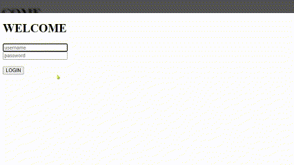
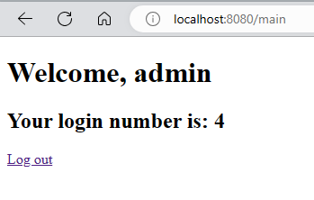

# SPRING WEB SCOPES

Previously we have looked at Singleton and Prototype bean scopes. There are certain scopes meant only for web application. These are:

- Request scope—Spring creates an instance of the bean class for every HTTP
  request. The instance exists only for that specific HTTP request.
- Session scope—Spring creates an instance and keeps the instance in the server's
  memory for the full HTTP session. Spring links the instance in the context with
  the client's session.
- Application scope—The instance is unique in the app's context, and it's available while the app is running

We will understand these with an app which has a login functionlity. The user would enter the credentials. This will be validated only for that particular request using request scope. We will keep that user logged in for a certain duration using session scope. Using application scope, we will maintain a count of logins by all the users.

## 🚀 Quick Navigation

- [Request Scope](#request-scope)
- [Session Scope](#session-scope)
- [Application Scope](#application-scope)

## REQUEST SCOPE

A request-scoped bean is an object managed by Spring, for which the framework
creates a new instance for every HTTP request. The app can use the instance only for the request that created it. Any new HTTP request (from the same or other clients) creates and uses a different instance of the same class.

Let's create a HTML form which the user can use to submit their credentials. A message will be displayed depending on the validity. We will use a `LoginProcessor` which will help with validation of user credentials. This class will be `@RequestScope`, so spring should create a bean for each HTTP request. We also need to mark it with `@Component` (or use `@Bean`) so that it can be managed by spring. First, `login.html`:

```html
<!DOCTYPE html>
<html lang="en" xmlns:th="http://www.thymeleaf.org">
  <head>
    <meta charset="UTF-8" />
    <title>Home page</title>
  </head>
  <body>
    <form action="/" method="post">
      <input type="text" name="username" />
      <br />
      <input type="text" name="password" />
      <br />
      <button type="submit">LOGIN</button>
    </form>

    <p th:text="${message}"></p>
  </body>
</html>
```

Let's now created the request scoped `LoginProcessor`:

```java
package com.example.demo.util;

import org.springframework.stereotype.Component;
import org.springframework.web.context.annotation.RequestScope;

@RequestScope
@Component
public class LoginProcessor {

    private String username;
    private String password;

    public LoginProcessor(){
        System.out.println(">>>> constructing LoginProcessor");
    }

    public boolean validateLogin(String username, String password){
        if(username.equals("admin") && password.equals("pwd123"))
            return true;
        else
            return false;
    }

    public String getUsername() {
        return username;
    }

    public void setUsername(String username) {
        this.username = username;
    }

    public String getPassword() {
        return password;
    }

    public void setPassword(String password) {
        this.password = password;
    }
}
```

We will create two methods in `LoginController`, both to handle requests at "/". One of them will be for HTTP GET and another for HTTP POST. When the user submits the form after adding the credentials, it will call the HTTP POST mapped method in the controller. We are using `@RequestParam` to capture the credentials. We will pass this to `LoginProcessor` for validation. Then we set the message attribute in `Model` based on validaty of the credentials.

```java
package com.example.demo.controller;

import com.example.demo.util.LoginProcessor;
import org.springframework.stereotype.Controller;
import org.springframework.ui.Model;
import org.springframework.web.bind.annotation.GetMapping;
import org.springframework.web.bind.annotation.PostMapping;
import org.springframework.web.bind.annotation.RequestParam;

@Controller
public class LoginController {

    @GetMapping("/")
    public String login(){
        return "login.html";
    }

    LoginProcessor loginProcessor;

    public LoginController(LoginProcessor loginProcessor){
        this.loginProcessor = loginProcessor;
    }

    @PostMapping("/")
    public String loginUser(@RequestParam String username, @RequestParam String password, Model model){

        boolean loggedIn = true;

        //validate
        loggedIn = loginProcessor.validateLogin(username, password);

        if(loggedIn){
            model.addAttribute("message", "login successful.");
        }else{
            model.addAttribute("message", "login failed.");
        }

        return "login.html";

    }

}
```

We can notice that the constructor for `LoginProcessor` getting called each time we try to login. For successful login, we can use `admin/pwd123` to login which has been hardcoded for this example:


## SESSION SCOPE

We will build upon our previous example to add a session scope. We will create a session scope bean for `LoggedUserManagementService` which will just store the username. After a user logs in successfully, we will set this username. If the user tries to access /main directly, we will check if the user has already logged in by checking if the value of username is set for bean `LoggedUserManagementService`. If it's set, we can return `main.html` view otherwise, we will redirect to login page.

Let us start by creating the `LoggedUserManagementService` which will be session scoped.

```java
package com.example.demo.service;

import org.springframework.stereotype.Service;
import org.springframework.web.context.annotation.SessionScope;

@Service
@SessionScope
public class LoggedUserManagementService {

    private String username;

    public String getUsername() {
        return username;
    }

    public void setUsername(String username) {
        this.username = username;
    }
}
```

Now, let's use this in our `LoginProcessor`. We have added a dependency for `LoggedUserManagementService` which will be injected by spring using DI. `LoginProcessor` will still be request scope. We have also updated the `login()` method to store the username using `loggedUserManagementService.setUsername(username)`. We will use this to check if the user is already logged in.

```java
package com.example.demo.util;

import com.example.demo.service.LoggedUserManagementService;
import org.springframework.stereotype.Component;
import org.springframework.web.context.annotation.RequestScope;

@RequestScope
@Component
public class LoginProcessor {

    private String username;
    private String password;

    private final LoggedUserManagementService loggedUserManagementService;

    public LoginProcessor(LoggedUserManagementService loggedUserManagementService){
        this.loggedUserManagementService = loggedUserManagementService;
    }

    public String getUsername() {
        return username;
    }

    public void setUsername(String username) {
        this.username = username;
    }

    public String getPassword() {
        return password;
    }

    public void setPassword(String password) {
        this.password = password;
    }

    public boolean login(){

        String username = this.getUsername();
        String password = this.getPassword();

        if(username.equals("admin") && password.equals("pwd123")){

            //set the logged username to the session bean
            loggedUserManagementService.setUsername(username);

            return true;
        }else{
            return false;
        }

    }
}

```

Now let us create another controller for the App `MainController`. This will have a dependency for `LoggedUserManagementService`. If the user acccesses /main, it will check if the user is already logged in by checking if `username` is not null for `loggedUserManagementService`. If it is null, redirect to `/`. Which will be handled by the previous controller `LoginController`. We will update that next.

```java
package com.example.demo.controller;

import com.example.demo.service.LoggedUserManagementService;
import org.springframework.stereotype.Controller;
import org.springframework.ui.Model;
import org.springframework.web.bind.annotation.GetMapping;
import org.springframework.web.bind.annotation.RequestParam;

@Controller
public class MainController {

    private final LoggedUserManagementService loggedUserManagementService;

    public MainController(LoggedUserManagementService loggedUserManagementService){
        this.loggedUserManagementService = loggedUserManagementService;
    }

    @GetMapping("/main")
    public String home(@RequestParam(required = false) String logout, Model model){

        //if requestParam has logout key, set the username to null
        if(logout != null){
            loggedUserManagementService.setUsername(null);
        }

        String username = loggedUserManagementService.getUsername();

        if(username == null){
            return "redirect:/";
        }

        model.addAttribute("username", username);
        return "main.html";

    }

}
```

The HTTP GET call to `/` will show the `login.html` page. The HTML page has a form. Once the user submit the form, the corresponding HTTP POST method will be called `loginPost()`. It will check if the credentials are valid. If they are not valid, add a message "login failed" which will be rendered by `login.html`. If it is valid, the login() method of `LoginProcessor` would have also set the username for `loggedUserManagementService` and we can redirect the call to `/main` which will be handled by `MainController`.

```java
package com.example.demo.controller;

import com.example.demo.util.LoginProcessor;
import org.springframework.stereotype.Controller;
import org.springframework.ui.Model;
import org.springframework.web.bind.annotation.GetMapping;
import org.springframework.web.bind.annotation.PostMapping;
import org.springframework.web.bind.annotation.RequestParam;

@Controller
public class LoginController {

    private final LoginProcessor loginProcessor;

    public LoginController(LoginProcessor loginProcessor){
        this.loginProcessor = loginProcessor;
    }

    @GetMapping("/")
    public String loginGet(){
        return "login.html";
    }

    @PostMapping("/")
    public String loginPost(@RequestParam String username, @RequestParam String password, Model model){

        boolean loggedIn = false;

        loginProcessor.setUsername(username);
        loginProcessor.setPassword(password);

        loggedIn = loginProcessor.login();

        if(loggedIn){
            return "redirect:/main";
        }else{
            model.addAttribute("message", "login failed");
        }

        return "login.html";

    }

}
```



## APPLICATION SCOPE

The application scope is close to how a singleton works. The difference is that you can't have more instances of the same type in the context and that we always use the HTTP requests as a reference point when discussing the life cycle of web scopes (including the application scope).

We will add a feature to our previous app in which we show the login attempts (count) made by all the users.

Let us start by creating the application scope `LoginCountService`. This will maintain the count of log in attempts and it will have a method to increment it during logins.

```java
package com.example.demo.service;

import org.springframework.stereotype.Service;
import org.springframework.web.context.annotation.ApplicationScope;

@Service
@ApplicationScope
public class LoginCountService {

    private int count;

    public void increment(){
        count++;
    }

    public int getCount() {
        return count;
    }

}

```

Next, we will use this in `LoginProcessor`. We add `LoginCountService` as a dependency and also add the logic to increment the count when someone tries to `login()`.

```java
package com.example.demo.util;

import com.example.demo.service.LoggedUserManagementService;
import com.example.demo.service.LoginCountService;
import org.springframework.stereotype.Component;
import org.springframework.web.context.annotation.RequestScope;

@RequestScope
@Component
public class LoginProcessor {

    private String username;
    private String password;

    private final LoggedUserManagementService loggedUserManagementService;
    private final LoginCountService loginCountService;

    public LoginProcessor(LoggedUserManagementService loggedUserManagementService, LoginCountService loginCountService){
        this.loggedUserManagementService = loggedUserManagementService;
        this.loginCountService = loginCountService;
    }

    public String getUsername() {
        return username;
    }

    public void setUsername(String username) {
        this.username = username;
    }

    public String getPassword() {
        return password;
    }

    public void setPassword(String password) {
        this.password = password;
    }

    public boolean login(){

        //increase the login attempt
        loginCountService.increment();

        String username = this.getUsername();
        String password = this.getPassword();

        if(username.equals("admin") && password.equals("pwd123")){

            //set the logged username to the session bean
            loggedUserManagementService.setUsername(username);

            return true;
        }else{
            return false;
        }

    }
}
```

We also need to pass this count value to the view once the user is logged in. We can do this in `MainController` using `model.addAttribute("loginCount", loginCount)`. This wil be used to render in the `main.html` template.

```java
package com.example.demo.controller;

import com.example.demo.service.LoggedUserManagementService;
import com.example.demo.service.LoginCountService;
import org.springframework.stereotype.Controller;
import org.springframework.ui.Model;
import org.springframework.web.bind.annotation.GetMapping;
import org.springframework.web.bind.annotation.RequestParam;

@Controller
public class MainController {

    private final LoggedUserManagementService loggedUserManagementService;
    private final LoginCountService loginCountService;

    public MainController(LoggedUserManagementService loggedUserManagementService, LoginCountService loginCountService){
        this.loggedUserManagementService = loggedUserManagementService;
        this.loginCountService = loginCountService;
    }

    @GetMapping("/main")
    public String home(@RequestParam(required = false) String logout, Model model){

        if(logout != null){
            loggedUserManagementService.setUsername(null);
        }

        String username = loggedUserManagementService.getUsername();
        int loginCount = loginCountService.getCount();

        if(username == null){
            return "redirect:/";
        }

        model.addAttribute("username", username);
        model.addAttribute("loginCount", loginCount);

        return "main.html";

    }

}
```

Our updated main.html can now use the count value using `<span th:text="${loginCount}"></span>`.

```html
<!DOCTYPE html>
<html lang="en" xmlns:th="http://www.thymeleaf.org">
  <head>
    <meta charset="UTF-8" />
    <title>Home Page</title>
  </head>
  <body>
    <h1>Welcome, <span th:text="${username}"></span></h1>

    <h2>Your login number is: <span th:text="${loginCount}"></span></h2>

    <a href="/main?logout">Log out</a>
  </body>
</html>
<!DOCTYPE html>
<html lang="en" xmlns:th="http://www.thymeleaf.org">
  <head>
    <meta charset="UTF-8" />
    <title>Home Page</title>
  </head>
  <body>
    <h1>Welcome, <span th:text="${username}"></span></h1>

    <h2>Your login number is: <span th:text="${loginCount}"></span></h2>

    <a href="/main?logout">Log out</a>
  </body>
</html>
```



<a href="#top" style="position: fixed; bottom: 20px; right: 20px;">Go to Top</a>
