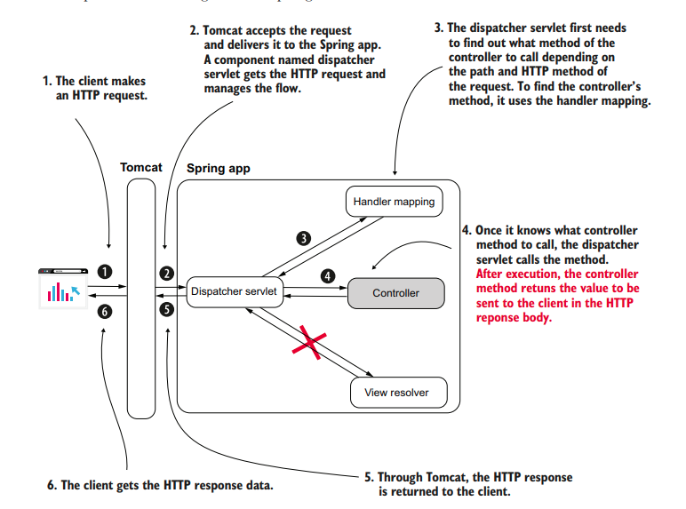

# IMPLEMENTING REST SERVICES

- [Managing HTTP Response](#managing-http-response)
- [Returning an Object in a REST Controller](#returning-an-object-in-a-rest-controller)
- [Custom Response Status and Headers (ResponseEntity)](#custom-response-status-and-headers-responseentity)
- [Managing Exceptions at the Endpoint Level](#managing-exceptions-at-the-endpoint-level)
  - [Using Custom Exception](#using-custom-exception)
  - [Using REST Controller Advice](#using-rest-controller-advice)
- [Using REST Body to get data from the client](#using-a-request-body-to-get-data-from-the-client)



Here's an example:

The annotation `@ResponseBody` tells the dispatcher servlet that the controller's action doesn't return a view name but the data sent directly in the HTTP response. To avoid adding this annotation one each method, spring provides another way, which is to annotated the class with `@RestController`.

```java
package com.example.demo.controller;

import org.springframework.stereotype.Controller;
import org.springframework.web.bind.annotation.GetMapping;
import org.springframework.web.bind.annotation.ResponseBody;

@Controller
public class HelloController {

    @GetMapping("/hello")
    @ResponseBody
    public String hello(){
        return "hello!";
    }

}
```

Using `@RestController`:

```java
package com.example.demo.controller;

import org.springframework.web.bind.annotation.GetMapping;
import org.springframework.web.bind.annotation.RestController;

@RestController
public class HelloController {

    @GetMapping("/hello")
    public String hello(){
        return "hello!";
    }

}
```

TEST:

```bash
curl -X GET http://localhost:8080/hello
hello!
```

## MANAGING HTTP RESPONSE

The HTTP response holds data as the following:

- **Response Headers**: Short pieces of data in the response (usually not more than a few words long).

- **Response Body**: A larger amount of data the backend needs to send in the response.

- **Response Status**: A short representation of the request's result.

### RETURNING AN OBJECT IN A REST CONTROLLER

When we use an object (such as `Country`) to model the data transferred between two apps, we name this object a `data transfer object (DTO)`. We can say that `Country` is our `DTO`, whose instances are returned by the REST endpoint we implement in the HTTP response body.

Here is an example to show a response when we return an object.

```java
package com.example.demo.model;

public class Country {

    private String name;
    private int population;


    //To make a Country instance simpler, we define a static factory method that receives the name and
    //the population. This method returns a Country instance with the provided values set.
    public static Country of(String name, int population){
        Country country = new Country();
        country.setName(name);
        country.setPopulation(population);
        return country;
    }

    public String getName() {
        return name;
    }

    public void setName(String name) {
        this.name = name;
    }

    public int getPopulation() {
        return population;
    }

    public void setPopulation(int population) {
        this.population = population;
    }
}
```

```java
package com.example.demo.controller;

import com.example.demo.model.Country;
import org.springframework.web.bind.annotation.GetMapping;
import org.springframework.web.bind.annotation.RestController;

import java.util.List;

@RestController
public class CountryController {

    @GetMapping("/france")
    public Country france(){
        Country country = Country.of("France", 67);
        return country;
    }

    @GetMapping("/all")
    public List<Country> countries(){
        Country country1 = Country.of("France", 67);
        Country country2 = Country.of("Spain", 47);

        return List.of(country1, country2);
    }

}
```

```bash
curl http://localhost:8080/france
{"name":"France","population":67}

curl http://localhost:8080/all
[{"name":"France","population":67},{"name":"Spain","population":47}]
```

> By default, Spring creates a string representation of the object and formats it as JSON.

### CUSTOM RESPONSE STATUS AND HEADERS (ResponseEntity)

To send custom HTTP status code or Custom Headers, we can make use of `ResponseEntity`. Example:

```java
@GetMapping("/france")
public ResponseEntity<Country> france(){

    Country country = Country.of("France", 67);

    return ResponseEntity.status(HttpStatus.ACCEPTED)
            .header("Continent","Europe")
            .header("Capital", "Paris")
            .body(country);

}
```

```bash
curl http://localhost:8080/france -I
HTTP/1.1 202
Continent: Europe
Capital: Paris
Content-Type: application/json
Transfer-Encoding: chunked
Date: Sun, 24 Dec 2023 17:42:46 GMT
```

### MANAGING EXCEPTIONS AT THE ENDPOINT LEVEL

It's essential to consider what happens if the controller's action throws an exception. One way to handle is to return a different `ResponseEntity` when that exception happens. Another way which we will look at is by using REST controller advice class - an aspect that intercepts an endpoint call when it throws an exception, and you can specify a custom logic to be executed for that specific exception.

#### USING CUSTOM EXCEPTION

We will use a `PaymentService` which will generate a custom Exception `NotEnoughMoneyException`. For simulation purpose, we will generate a random value for `x` in `processPayment()` method, depending on which the exception will be thrown.

Let's look into the implementation. We will have two model classes, one for successful payment and another to handle the exception. We will use a Custom Exception in this example:

```java
package com.example.demo.exception;

public class NotEnoughMoneyException extends RuntimeException{
}
```

```java
package com.example.demo.model;

public class PaymentDetail {

    private double amount;

    public double getAmount() {
        return amount;
    }

    public void setAmount(double amount) {
        this.amount = amount;
    }
}
```

```java
package com.example.demo.model;

public class ErrorDetail {

    private String message;

    public String getMessage() {
        return message;
    }

    public void setMessage(String message) {
        this.message = message;
    }
}
```

Next, we will create the payment service:

```java
package com.example.demo.service;

import com.example.demo.exception.NotEnoughMoneyException;
import com.example.demo.model.PaymentDetail;
import org.springframework.stereotype.Service;

import java.util.Random;

@Service
public class PaymentService {

    public PaymentDetail processPayment(){

        //simulate successful and failed payment using a random number
        Random random = new Random();
        int x = random.nextInt(2);

        if (x == 0) {
            throw new NotEnoughMoneyException();
        } else {
            PaymentDetail paymentDetail = new PaymentDetail();
            paymentDetail.setAmount(100);
            return paymentDetail;
        }

    }

}
```

Use this payment service in the controller:

```java
package com.example.demo.controller;

import com.example.demo.exception.NotEnoughMoneyException;
import com.example.demo.model.ErrorDetail;
import com.example.demo.model.PaymentDetail;
import com.example.demo.service.PaymentService;
import org.springframework.http.HttpStatus;
import org.springframework.http.ResponseEntity;
import org.springframework.web.bind.annotation.PostMapping;
import org.springframework.web.bind.annotation.RestController;

@RestController
public class PaymentController {

    private final PaymentService paymentService;

    public PaymentController(PaymentService paymentService){
        this.paymentService = paymentService;
    }

    @PostMapping("/payment")
    public ResponseEntity<?> makePayment(){

        try{

            PaymentDetail paymentDetail =  paymentService.processPayment();

            return ResponseEntity
                    .status(HttpStatus.ACCEPTED)
                    .body(paymentDetail);


        }catch (NotEnoughMoneyException e){

            ErrorDetail errorDetail = new ErrorDetail();
            errorDetail.setMessage("Not enough money to make the payment");

            return ResponseEntity
                    .status(HttpStatus.BAD_REQUEST)
                    .body(errorDetail);

        }


    }

}
```

For multiple runs, the response will be different based on the random value which `x` variable would get in the `processPayment()` method of `PaymentService` class.

```bash
curl -X POST http://localhost:8080/payment -H "Content-Type: application/json" -d '{}'
{"amount":100.0}

curl -X POST http://localhost:8080/payment -H "Content-Type: application/json" -d '{}'
{"message":"Not enough money to make the payment"}
```

This is commonly used in the real world to handle the exceptions. However, in a more complex application, you would find it more comfortable to separate the responsibility of exception management. This will also avoid duplicate code. So we use REST controller advice for this.

#### USING REST CONTROLLER ADVICE

We can start by updating the `processPayment()` method in the `PaymentController` to only handle the "good" case:

```java
package com.example.demo.controller;

import com.example.demo.exception.NotEnoughMoneyException;
import com.example.demo.model.ErrorDetail;
import com.example.demo.model.PaymentDetail;
import com.example.demo.service.PaymentService;
import org.springframework.http.HttpStatus;
import org.springframework.http.ResponseEntity;
import org.springframework.web.bind.annotation.PostMapping;
import org.springframework.web.bind.annotation.RestController;

@RestController
public class PaymentController {

    private final PaymentService paymentService;

    public PaymentController(PaymentService paymentService){
        this.paymentService = paymentService;
    }

    @PostMapping("/payment")
    public ResponseEntity<?> makePayment(){

            PaymentDetail paymentDetail =  paymentService.processPayment();
            return ResponseEntity
                    .status(HttpStatus.ACCEPTED)
                    .body(paymentDetail);


    }

}
```

At this point, if we run our app, we may get HTTP 500:

```bash
curl -X POST http://localhost:8080/payment -H "Content-Type: application/json" -d '{}'
{"timestamp":"2023-12-25T09:13:05.704+00:00","status":500,"error":"Internal Server Error","path":"/payment"}
```

Now we can create our aspect for handling the exception. To mark it as a REST controller advice, we use the annotation `@RestControllerAdvice`. The exception handler method will get called when an exception happens. We define the type of exception using the annotation `@ExceptionHandler` and pass along the Exception type, which in our case is `NotEnoughMoneyException.class`.

```java
package com.example.demo.controller;

import com.example.demo.exception.NotEnoughMoneyException;
import com.example.demo.model.ErrorDetail;
import org.apache.coyote.Response;
import org.springframework.http.HttpStatus;
import org.springframework.http.ResponseEntity;
import org.springframework.web.bind.annotation.ExceptionHandler;
import org.springframework.web.bind.annotation.RestControllerAdvice;

@RestControllerAdvice
public class ExceptionControllerAdvice {

    @ExceptionHandler(NotEnoughMoneyException.class)
    public ResponseEntity<ErrorDetail> exceptionNotEnoughMoneyHandler(){

        ErrorDetail errorDetail = new ErrorDetail();
        errorDetail.setMessage("Not enough money to complete the transaction.");

        return ResponseEntity
                .status(HttpStatus.BAD_REQUEST)
                .body(errorDetail);

    }

}
```

Test:

```bash
curl -X POST http://localhost:8080/payment -H "Content-Type: application/json" -d '{}'
{"amount":100.0}

curl -X POST http://localhost:8080/payment -H "Content-Type: application/json" -d '{}'
{"message":"Not enough money to complete the transaction."}
```

Additionally, we can add a parameter to the advice's exception handler method of the type of the handled exception. Spring is smart enough to pass the exception reference from the controller to the advice's exception handler method.

```java
@ExceptionHandler(NotEnoughMoneyException.class)
public ResponseEntity<ErrorDetail> exceptionNotEnoughMoneyHandler(NotEnoughMoneyException e){

    ErrorDetail errorDetail = new ErrorDetail();
    errorDetail.setMessage("Not enough money to complete the transaction. " + "ERROR CLASS: " + e.getClass());

    return ResponseEntity
            .status(HttpStatus.BAD_REQUEST)
            .body(errorDetail);

}
```

### USING A REQUEST BODY TO GET DATA FROM THE CLIENT

To use the request body, we just need to annotate a parameter of the controller's action with `@RequestBody`. By default, Spring assumes you used JSON to represent the parameter you annotated and will try to decode the JSON string into an instance of your parameter type. In the case Spring cannot decode the JSON-formatted string into that type, the app sends back a response with the status `400 Bad Request`.

```java
package com.example.demo.controller;

import com.example.demo.model.PaymentDetail;
import org.springframework.http.HttpStatus;
import org.springframework.http.ResponseEntity;
import org.springframework.web.bind.annotation.PostMapping;
import org.springframework.web.bind.annotation.RequestBody;
import org.springframework.web.bind.annotation.RestController;

import java.util.logging.Logger;

@RestController
public class PaymentController {

    Logger logger = Logger.getLogger(PaymentController.class.getName());

    @PostMapping("/payment")
    public ResponseEntity<PaymentDetail> processPayment(@RequestBody PaymentDetail paymentDetail){

        logger.info("Received payment of: " + paymentDetail.getAmount());

        return ResponseEntity
                .status(HttpStatus.ACCEPTED)
                .body(paymentDetail);

    }

}
```

```bash
curl -X POST http://localhost:8080/payment -H "Content-Type: application/json" -d '{"amount": 100.00}'
```

> Can an HTTP GET endpoint use a request body?
> Before 2014, the HTTP protocol specification didn't allow a request body for HTTP GET calls. No implementation for the client or server side allowed you to use a request body with an HTTP GET call. [RFC 7231](https://datatracker.ietf.org/doc/html/rfc7231#page-24)
