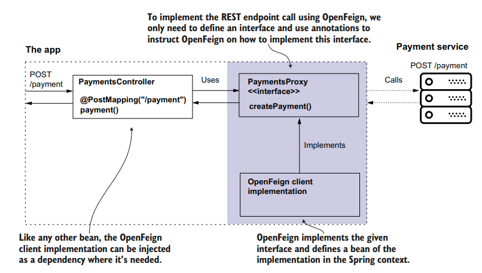

# CONSUMING REST ENDPOINTS

We will create a service which has a REST endpoint `/payment` for HTTP POST request. We will create another service which consumes this REST endpoint in three ways:

1. [**OpenFeign:**](#using-openfeigh-client)
   - Offered by the Spring Cloud project.
   - Recommended for new apps to consume REST endpoints.
2. [**RestTemplate:**](#using-rest-template)

   - Traditionally used (since Spring 3) for REST endpoint calls.
   - Still used but considered less preferable compared to OpenFeign.

3. [**WebClient:**](#using-webclient)
   - Spring's alternative to RestTemplate.
   - Generally used with reactive programming.

Let us first prepare the Payment Service which we need to consume.

Model class `Payment` to capture the Payment request from the client:

```java
package com.example.demo.model;

public class Payment {

    private String id;
    private double amount;

    public String getId() {
        return id;
    }

    public void setId(String id) {
        this.id = id;
    }

    public double getAmount() {
        return amount;
    }

    public void setAmount(double amount) {
        this.amount = amount;
    }
}
```

Controller for REST endpoint for `/payment`:

```java
package com.example.demo.controller;

import com.example.demo.model.Payment;
import org.springframework.http.HttpStatus;
import org.springframework.http.ResponseEntity;
import org.springframework.web.bind.annotation.PostMapping;
import org.springframework.web.bind.annotation.RequestBody;
import org.springframework.web.bind.annotation.RequestHeader;
import org.springframework.web.bind.annotation.RestController;

import java.util.UUID;
import java.util.logging.Logger;

@RestController
public class PaymentController {

    Logger logger = Logger.getLogger(PaymentController.class.getName());

    @PostMapping("/payment")
    public ResponseEntity<Payment> createPayment(@RequestHeader String requestId, @RequestBody Payment payment){

        logger.info("Received request with ID: " + requestId + ";Payment Amount: " + payment.getAmount());

        payment.setId(UUID.randomUUID().toString());

        return ResponseEntity
                .status(HttpStatus.OK)
                .header("RequestID" + requestId)
                .body(payment);

    }

}
```

**Test:**

```bash
 curl -X POST -H "Content-Type: application/json" -H "requestId: 354658768" -d '{"amount" : 100}'  http://localhost:8080/payment -s
{"id":"2935dd18-5c70-42bc-aa56-060a5248bbfb","amount":100.0}
```

## USING OPENFEIGH CLIENT

The RestTemplate class is currently in maintenance mode and will be deprecated. It would be better to use OpenFeign for consuming services.



### DEPENDENCIES

```xml
<properties>
    <java.version>17</java.version>
    <spring-cloud.version>2023.0.0</spring-cloud.version>
</properties>

<dependencies>

    <dependency>
        <groupId>org.springframework.boot</groupId>
        <artifactId>spring-boot-starter-web</artifactId>
    </dependency>

    <dependency>
        <groupId>org.springframework.cloud</groupId>
        <artifactId>spring-cloud-starter-openfeign</artifactId>
    </dependency>

    <dependency>
        <groupId>org.springframework.boot</groupId>
        <artifactId>spring-boot-starter-test</artifactId>
        <scope>test</scope>
    </dependency>
</dependencies>

 <dependencyManagement>
     <dependencies>
         <dependency>
            <groupId>org.springframework.cloud</groupId>
            <artifactId>spring-cloud-dependencies</artifactId>
            <version>${spring-cloud.version}</version>
            <type>pom</type>
            <scope>import</scope>
        </dependency>
    </dependencies>
</dependencyManagement>
```

Let's create the client using OpenFeign.

The first thing to do is annotate the interface with the `@FeignClient` annotation to tell OpenFeign it has to provide an implementation for this contract. We have to assign a name to the proxy using the `name` attribute of the `@FeignClient` annotation, which OpenFeign internally uses. The `name` uniquely identifies the client in your app. The `@FeignClient` annotation is also where we specify the base URI of the request. We can define the base URI as a string using the `url` attribute of `@FeignClient`.

Each method we declare in the interface represents a REST endpoint call.

```java
package com.example.demo;


import org.springframework.cloud.openfeign.FeignClient;
import org.springframework.web.bind.annotation.PostMapping;
import org.springframework.web.bind.annotation.RequestBody;
import org.springframework.web.bind.annotation.RequestHeader;

@FeignClient(name = "payments", url = "${name.service.url}")
public interface PaymentProxy {

    @PostMapping("/payment")
    Payment createPayment(@RequestHeader String requestId, @RequestBody Payment payment);

}
```

Let us define the value for `name.service.url` in `application.properties` file present under `resources` folder:

```properties
name.service.url=http://localhost:8080
server.port=9090
```

Next, we will need to create a configuration class to enable OpenFeign and provide the location of classes which contains the proxy interface.

```java
package com.example.demo.config;

import org.springframework.cloud.openfeign.EnableFeignClients;
import org.springframework.context.annotation.Configuration;

@Configuration
@EnableFeignClients(basePackages = "com.example.demo")
public class AppConfig {
}
```

We can now inject the OpenFeign client through the interface we defined in `PaymentProxy`. Once we enable OpenFeign, it knows to implement the interfaces annotated with `@FeignClient`. Spring is smart enough to provide us with a bean instance from its context when we use an abstraction, and this is exactly what happens here. We will inject the FeignClient in our RestController. Recall that the destination service has a REST endpoint `/payment` which accepts `HTTP POST` request and expects a header `requestId` and request body that will be mapped to `Payment`. Here OpenFeign is taking care of implementing the bean/code which will handle this call.

```java
package com.example.demo.controller;

import com.example.demo.model.Payment;
import com.example.demo.proxy.PaymentProxy;
import org.springframework.web.bind.annotation.PostMapping;
import org.springframework.web.bind.annotation.RequestBody;
import org.springframework.web.bind.annotation.RestController;

import java.util.UUID;

@RestController
public class PaymentController {

    private final PaymentProxy paymentProxy;

    public PaymentController(PaymentProxy paymentProxy){
        this.paymentProxy = paymentProxy;
    }

    @PostMapping("/payment")
    public Payment createPayment(@RequestBody Payment payment){

        String requestId = UUID.randomUUID().toString();
        return paymentProxy.createPayment(requestId, payment);

    }


}
```

**TEST:**

```bash
curl -X POST -H "Content-Type: application/json" -H "requestId: 354658768" -d "{\"amount\": 100}" http://localhost:8080/payment
{"id":"07929657-843a-4c42-a412-6aaf71b8460c","amount":100.0}
```

We will also see the following log in destination service:

```log
2023-12-25T18:23:34.529+05:30  INFO 16984 --- [nio-8080-exec-7] c.e.demo.controller.PaymentController    : Received request with ID: 069daa5c-d604-4a22-994b-0ff629769e32;Payment Amount: 100.0
```

## USING REST TEMPLATE

Let us first define the `PaymentProxy` class which will actually make use of `RestTemplate` to talk to the destination REST service.

The `createPayment()` method defines the header by creating an `HttpHeaders` instance and adding the needed header `requestId` to this instance using the `add()` method. It then creates a `HttpEntity` instance based on the headers and the body (received by the method as a parameter). The method then sends the HTTP request using RestTemplate's `exchange()` method. The `exchange()` method's parameters are the `URI` and the `HTTP` method, followed by the `HttpEntity` instance (that holds the request data) and the type expected for the response body.

```java
package com.example.demo.proxy;

import com.example.demo.model.Payment;
import org.springframework.beans.factory.annotation.Value;
import org.springframework.http.*;
import org.springframework.stereotype.Component;
import org.springframework.web.client.RestTemplate;

import java.util.UUID;

@Component
public class PaymentProxy {

    private final RestTemplate restTemplate;

    @Value("${name.service.url}")
    private String paymentServiceUrl;

    public PaymentProxy(RestTemplate restTemplate){
        this.restTemplate = restTemplate;
    }

    public Payment createPayment(Payment payment){

        String uri = paymentServiceUrl + "/payment";

        HttpHeaders httpHeaders = new HttpHeaders();
        httpHeaders.add("requestId", UUID.randomUUID().toString());

        HttpEntity<Payment> httpEntity = new HttpEntity<>(payment, httpHeaders);

        /* restTemplate.exchange() ->
        url - the URL
        method - the HTTP method (GET, POST, etc)
        requestEntity - the entity (headers and/or body) to write to the request may be null)
        responseType - the type to convert the response to, or Void.class for no body
        uriVariables - the variables to expand in the template
        */
        ResponseEntity<Payment> response = restTemplate.exchange(uri, HttpMethod.POST, httpEntity, Payment.class);

        return response.getBody();

    }


}
```

It seems that recent versions of Spring do not provide the bean for `RestTemplate`, so we can create it using configuration class with `@Bean` annotated method. Otherwise, we may get the following error:

> Consider defining a bean of type 'org.springframework.web.client.RestTemplate' in your configuration.

```java
//https://gist.github.com/RealDeanZhao/38821bc1efeb7e2a9bcd554cc06cdf96
package com.example.demo.config;

import org.springframework.context.annotation.Bean;
import org.springframework.context.annotation.Configuration;
import org.springframework.web.client.RestTemplate;

@Configuration
public class AppConfig {

    @Bean
    public RestTemplate RestTemplate(){
        return new RestTemplate();
    }

}
```

Finally, we can define the controller class, which will use the `PaymentProxy` class.

```java
package com.example.demo.controller;

import com.example.demo.model.Payment;
import com.example.demo.proxy.PaymentProxy;
import org.springframework.web.bind.annotation.PostMapping;
import org.springframework.web.bind.annotation.RequestBody;
import org.springframework.web.bind.annotation.RequestHeader;
import org.springframework.web.bind.annotation.RestController;

@RestController
public class PaymentController {

    private final PaymentProxy paymentProxy;

    public PaymentController(PaymentProxy paymentProxy){
        this.paymentProxy = paymentProxy;
    }

    @PostMapping("/payment")
    public Payment createPayment(@RequestBody Payment payment){
        return paymentProxy.createPayment(payment);
    }

}
```

**TEST:**

```bash
curl -X POST -H "Content-Type: application/json" -H "requestId: 354658768" -d '{"amount" : 100}'  http://localhost:9090/payment -s
{"id":"a7e96346-850e-4e85-a42f-82672065e623","amount":100.0}
```

Log in the destination:

```text
2023-12-25T19:05:56.224+05:30  INFO 16984 --- [nio-8080-exec-4] c.e.demo.controller.PaymentController    : Received request with ID: 1fe0c964-0bcc-4cb6-be5c-1903a51d22ff;Payment Amount: 100.0
```

## USING WEBCLIENT

Spring's documentation recommends using `WebClient`, but that's only a valid recommendation for reactive apps. For apps which are not reactive, use `OpenFeign` instead.
