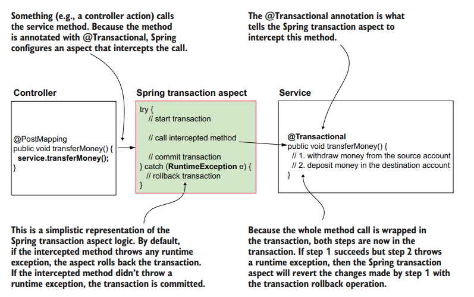

# USING TRANSACTION IN SPRING APPS

A transaction is a defined set of mutable operations (operations that change data) that can either correctly execute them altogether or not at all. We refer to this as **atomicity**.

`COMMIT`: The successful end of a transaction when the app stores all the
changes made by the transaction's mutable operations.

`ROLLBACK`: The transaction ends with rollback when the app restores the
data to the way it looked at the beginning of the transaction to avoid data
inconsistencies.

- [Understanding Transactions](#understanding-transactions)
- [Using Transactions in Spring Apps (Implementation)](#using-transactions-in-spring-apps-implementation)
  - [Dependencies Needed](#dependencies-needed)
  - [Prepare the Database Tables](#prepare-the-database-tables)
  - [Let's Code](#lets-code)
  - [Test for Atomicity](#test-for-atomicity)

## UNDERSTANDING TRANSACTIONS

To mark a method we want Spring to wrap in a transaction, we use an annotation named `@Transactional`. Behind the scenes, Spring configures an aspect (we don't implement this aspect ourselves; Spring provides it) and applies the transaction logic for the operations executed by that method.

> The method being called by the aspect (a service method in this example) needs to throw an exception futher to the aspect if something goes wrong during the transaction. If the method treats the exception in its logic and doesn't throw the exception further, the aspect can't know the exception occurred (so rollback will not happen).



### What about checked exceptions in transactions?

In Java with Spring, there are two types of exceptions: checked and runtime. By default, Spring rolls back a transaction only when it encounters a runtime exception, not a checked one.

Checked exceptions must be handled or declared in the code, and they don't automatically trigger a rollback in Spring. If needed, we can configure Spring to also roll back transactions for checked exceptions using the `@Transactional` annotation.

## USING TRANSACTIONS IN SPRING APPS (IMPLEMENTATION)

### DEPENDENCIES NEEDED

We will use H2 database for this example.

```xml
<dependencies>

    <dependency>
        <groupId>org.springframework.boot</groupId>
        <artifactId>spring-boot-starter-web</artifactId>
    </dependency>

    <dependency>
        <groupId>org.springframework.boot</groupId>
        <artifactId>spring-boot-starter-jdbc</artifactId>
    </dependency>

    <dependency>
        <groupId>com.h2database</groupId>
        <artifactId>h2</artifactId>
        <scope>runtime</scope>
    </dependency>

    <dependency>
        <groupId>org.springframework.boot</groupId>
        <artifactId>spring-boot-starter-test</artifactId>
        <scope>test</scope>
    </dependency>

</dependencies>
```

### PREPARE THE DATABASE TABLES

We will create an `account` table and add two rows (for two people) which we will be using later on. Put both of these files in the `resources` folder.

`schema.sql`

```sql
create table account (
 id INT NOT NULL AUTO_INCREMENT PRIMARY KEY,
 name VARCHAR(50) NOT NULL,
 amount DOUBLE NOT NULL
);
```

`data.sql`

```sql
INSERT INTO account (name, amount) VALUES ('Helen Down', 1000);
INSERT INTO account (name, amount) VALUES ('Peter Read', 1000);
```

### LET'S CODE

Let's start by creating the Model class for `Account`

```java
package com.example.demo.model;

import java.math.BigDecimal;
public class Account {
    private long id;
    private String name;

    private BigDecimal amount;

    public long getId() {
        return id;
    }

    public void setId(long id) {
        this.id = id;
    }

    public String getName() {
        return name;
    }

    public void setName(String name) {
        this.name = name;
    }

    public BigDecimal getAmount() {
        return amount;
    }

    public void setAmount(BigDecimal amount) {
        this.amount = amount;
    }
}
```

We will also need another model class to request a transfer request. This request should have the senderAccountId, receiverAccountId and the amount that needs to be transferred.

```java
package com.example.demo.model;

import java.math.BigDecimal;

public class TransferRequest {

    private long senderAccountId;
    private long receiverAccountId;

    private BigDecimal amount;

    public long getSenderAccountId() {
        return senderAccountId;
    }

    public void setSenderAccountId(long senderAccountId) {
        this.senderAccountId = senderAccountId;
    }

    public long getReceiverAccountId() {
        return receiverAccountId;
    }

    public void setReceiverAccountId(long receiverAccountId) {
        this.receiverAccountId = receiverAccountId;
    }

    public BigDecimal getAmount() {
        return amount;
    }

    public void setAmount(BigDecimal amount) {
        this.amount = amount;
    }
}
```

Now, we can create the repository class which will talk to the database. To map the account table with a Java Object, we will need to create a `RowMapper` as well.

```java
package com.example.demo.repository;

import com.example.demo.model.Account;
import org.springframework.jdbc.core.RowMapper;

import java.sql.ResultSet;
import java.sql.SQLException;

public class AccountRowMapper implements RowMapper<Account> {

    @Override
    public Account mapRow(ResultSet rs, int rowNum) throws SQLException {

        Account account = new Account();
        account.setId(rs.getInt("id"));
        account.setName(rs.getString("name"));
        account.setAmount(rs.getBigDecimal("amount"));

        return account;

    }
}
```

```java
package com.example.demo.repository;

import com.example.demo.model.Account;
import org.springframework.jdbc.core.JdbcTemplate;
import org.springframework.stereotype.Repository;

import java.math.BigDecimal;
import java.util.List;

@Repository
public class AccountRepository {

    private final JdbcTemplate jdbcTemplate;

    public AccountRepository(JdbcTemplate jdbcTemplate){
        this.jdbcTemplate = jdbcTemplate;
    }

    public Account findAccountById(long id){
        String sql = "SELECT * FROM account WHERE id = ?";
        return jdbcTemplate.queryForObject(sql, new AccountRowMapper(), id);
    }

    public void changeAmount(long id, BigDecimal amount){
        String sql = "UPDATE account SET amount = ? WHERE id = ?";
        jdbcTemplate.update(sql, amount, id);
    }

    public List<Account> findAllAccounts(){
        String sql = "SELECT * FROM account";
        return jdbcTemplate.query(sql, new AccountRowMapper());
    }

}
```

We can now create our service, which is where we will be use `@Transactional` annotation. The method itself is quite straight forward. We only need to use the `@Transactional` annotation to mark the method as transactional and tell Spring it needs to intercept this method's executions and wrap them in transactions

```java
package com.example.demo.service;

import com.example.demo.model.Account;
import com.example.demo.repository.AccountRepository;
import org.springframework.stereotype.Service;
import org.springframework.transaction.annotation.Transactional;

import java.math.BigDecimal;
import java.util.List;

@Service
public class TransferService {

    private final AccountRepository accountRepository;

    public TransferService(AccountRepository accountRepository){
        this.accountRepository = accountRepository;
    }

    @Transactional
    public void transferMoney(long senderId, long receiverId, BigDecimal amount){

        Account sender = accountRepository.findAccountById(senderId);
        Account receiver = accountRepository.findAccountById(receiverId);

        BigDecimal senderNewAmount = sender.getAmount().subtract(amount);
        BigDecimal receiverNewAmount = receiver.getAmount().add(amount);

        accountRepository.changeAmount(senderId, senderNewAmount);
        accountRepository.changeAmount(receiverId, receiverNewAmount);

    }

    public List<Account> findAllAccounts(){
        return accountRepository.findAllAccounts();
    }

}
```

> We can also have `@Transactional` annotation at the class level.
> Applying `@Transactional` at the class level means all methods within that class will inherit the transactional behavior by default.
> We apply it at the class level to avoid repeating the annotation on each method.
> If a method has its own `@Transactional` annotation, it will override the class-level annotation, allowing us to set different transactional behavior for that particular method.

We will now expose the service using REST controller:

```java
package com.example.demo.controller;

import com.example.demo.model.Account;
import com.example.demo.model.TransferRequest;
import com.example.demo.service.TransferService;
import org.springframework.web.bind.annotation.*;

import java.util.List;

@RestController
@RequestMapping("/accounts")
public class AccountController {

    private final TransferService transferService;

    public AccountController(TransferService transferService){
        this.transferService = transferService;
    }

    @PostMapping("/transfer")
    public void transferMoney(@RequestBody TransferRequest transferRequest){
        transferService.transferMoney(
                transferRequest.getSenderAccountId(),
                transferRequest.getReceiverAccountId(),
                transferRequest.getAmount()
        );
    }

    @GetMapping
    public List<Account> findAllAccounts(){
        return transferService.findAllAccounts();
    }

}
```

**TEST:**

```bash
curl -X GET http://localhost:8080/accounts -s
[{"id":1,"name":"Helen Down","amount":1000.0},{"id":2,"name":"Peter Read","amount":1000.0}]

curl -X POST -H "content-type:application/json" -d '{"senderAccountId":1, "receiverAccountId":2, "amount":100}' http://localhost:8080/accounts/transfer -s

curl -X GET http://localhost:8080/accounts -s                        [{"id":1,"name":"Helen Down","amount":900.0},{"id":2,"name":"Peter Read","amount":1100.0}]
```

### TEST FOR ATOMICITY

We can throw a `RuntimeException` in the `@Transactional` annotated class. We would expect an atomic method to either successfully complete or fail completely. We cannot have a partially completed task. To test this, let us add a `RuntimeException` in our service method:

```java
@Transactional
public void transferMoney(long senderId, long receiverId, BigDecimal amount){

    Account sender = accountRepository.findAccountById(senderId);
    Account receiver = accountRepository.findAccountById(receiverId);

    BigDecimal senderNewAmount = sender.getAmount().subtract(amount);
    BigDecimal receiverNewAmount = receiver.getAmount().add(amount);

    accountRepository.changeAmount(senderId, senderNewAmount);
    accountRepository.changeAmount(receiverId, receiverNewAmount);

    throw new RuntimeException("Oh no! Something went wrong!");

}
```

If we test our app now, it will throw an error while updating the amount, however, the values will be rolled back to the previous original value (although the changeAmount() would have been called in the transferMoney() method)

```bash
 curl -X GET http://localhost:8080/accounts -s
[{"id":1,"name":"Helen Down","amount":1000.0},{"id":2,"name":"Peter Read","amount":1000.0}]

curl -X POST -H "content-type:application/json" -d '{"senderAccountId":1, "receiverAccountId":2, "amount":100}' http://localhost:8080/accounts/transfer -s
{"timestamp":"2023-12-27T16:00:57.396+00:00","status":500,"error":"Internal Server Error","path":"/accounts/transfer"}

curl -X GET http://localhost:8080/accounts -s
[{"id":1,"name":"Helen Down","amount":1000.0},{"id":2,"name":"Peter Read","amount":1000.0}]
```
