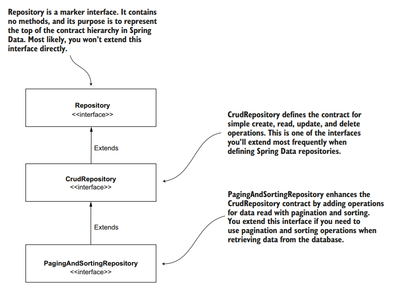
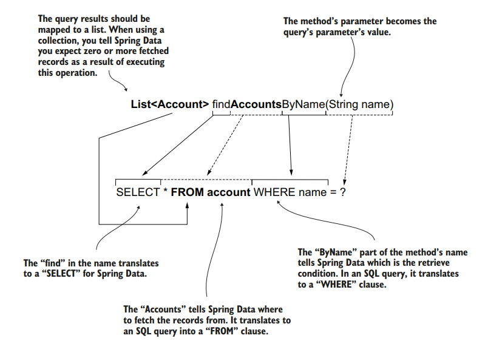

# IMPLEMENTING DATA PERSISTENCE WITH SPRING DATA

Spring Data provides different Maven dependencies for various persistence technologies, such as JDBC, MongoDB, Neo4J, etc. You only need to add the module that matches your persistence choice to your project.

It defines a common set of interfaces, such as `Repository`, `CrudRepository`, and `PagingAndSortingRepository`, that you can extend to create your app's repositories. Spring Data will provide the implementations for these interfaces at runtime.



> @Respository annotation that we used earlier is different than this Repository

Some specific Spring Data modules extend the contract chain even further, adding operations that are particular to their technology. For example, if the app uses MongoDB, we could define our Spring Data repositories extending the `MongoRepository` interface, which is particular for Spring Data Mongo.
If we use `Hibernate` (which implements the JPA specifications), we could extend the `JpaRepository` contract, which adds operations that are specific for using the JPA approach.

The app could still implement Crud Repository if it doesn't need more than the CRUD operations, but these specific contracts usually provide solutions that are more comfortable to use with the specific technology they're made for.

- [Using Spring Data JDBC](#using-spring-data-jdbc)
  - [Dependencies Needed](#dependencies-needed)
  - [Schema Files](#schema-files)
  - [Let's Code](#lets-code)

## USING SPRING DATA JDBC

### DEPENDENCIES NEEDED

```xml
<dependencies>

    <dependency>
        <groupId>org.springframework.boot</groupId>
        <artifactId>spring-boot-starter-web</artifactId>
    </dependency>

    <dependency>
        <groupId>org.springframework.boot</groupId>
        <artifactId>spring-boot-starter-data-jdbc</artifactId>
    </dependency>

    <dependency>
        <groupId>com.h2database</groupId>
        <artifactId>h2</artifactId>
        <scope>runtime</scope>
    </dependency>

    <dependency>
        <groupId>org.springframework.boot</groupId>
        <artifactId>spring-boot-starter-test</artifactId>
        <scope>test</scope>
    </dependency>

</dependencies>
```

### SCHEMA FILES

schema.sql

```sql
create table account (
 id INT NOT NULL AUTO_INCREMENT PRIMARY KEY,
 name VARCHAR(50) NOT NULL,
 amount DOUBLE NOT NULL
);
```

data.sql

```sql
INSERT INTO account (name, amount) VALUES ('Helen Down', 1000);
INSERT INTO account (name, amount) VALUES ('Peter Read', 1000);
```

### LET'S CODE

Let us first create the Model classes which we will need. We will add the annotation `@Id` to mark it a primary key.

```java
package com.example.demo.model;

import org.springframework.data.annotation.Id;

import java.math.BigDecimal;

public class Account {

    @Id
    private long id;
    private String name;
    private BigDecimal amount;

    public long getId() {
        return id;
    }

    public void setId(long id) {
        this.id = id;
    }

    public String getName() {
        return name;
    }

    public void setName(String name) {
        this.name = name;
    }

    public BigDecimal getAmount() {
        return amount;
    }

    public void setAmount(BigDecimal amount) {
        this.amount = amount;
    }
}
```

The next `Data Transfer Object (DTO)` which will be used to collect information while transferring money from the accounts:

```java
package com.example.demo.model;

import java.math.BigDecimal;

public class TransferRequest {

    private long senderAccountId;
    private long receiverAccountId;
    private BigDecimal amount;

    public long getSenderAccountId() {
        return senderAccountId;
    }

    public void setSenderAccountId(long senderAccountId) {
        this.senderAccountId = senderAccountId;
    }

    public long getReceiverAccountId() {
        return receiverAccountId;
    }

    public void setReceiverAccountId(long receiverAccountId) {
        this.receiverAccountId = receiverAccountId;
    }

    public BigDecimal getAmount() {
        return amount;
    }

    public void setAmount(BigDecimal amount) {
        this.amount = amount;
    }
}
```

The most important and interesting class, for the repository. Since we will use the general CRUD operations, we can extend `CrudRepository<Account, Long>`. The first generic type value is the type of the model class representing the table. The second is the type of the primary key field.

The best part is, the implementation of this interface will be automatically created by Spring Data! Additionally, we can follow certain conventions while naming these method and Spring Data can automagically implement methods for them. For example, add we needed to add was `List<Account> findAccountByName(String name)` and Spring understood that we need to run a query which is equivalent of `"SELECT \* FROM account WHERE name = ?"`.

> When the method name starts with `find` Spring Data knows you want to `SELECT`
> something. Next, the word `Accounts` tells Spring Data what you want to `SELECT`.
> Spring Data is so smart that I could have even named the method `findByName`. It
> would still know what to select just because the method is in the `AccountRepository` interface.



Using Spring Data's method naming for query translation can initially seem magical but has drawbacks:

Complexity leads to lengthy, unreadable method names.

- Risk of unintentional app behavior changes due to method name refactoring.
- Need to learn specific Spring Data naming rules beyond SQL knowledge.
- Performance impact from translating method names into queries during app initialization.

To overcome these issues, prefer `@Query` annotation in Spring Data, enabling explicit SQL query definition for improved readability, maintainability, and performance.

> We use the `@Query` annotation in the same way to define any query. However, when
> the query changes data, we also need to annotate the method with the `@Modifying`
> annotation. If we use `UPDATE`, `INSERT`, or `DELETE`, we also need to annotate the
> method with `@Modifying` (like we have done by `changeAmount()` method above).

```java
package com.example.demo;

import com.example.demo.model.Account;
import org.springframework.data.jdbc.repository.query.Modifying;
import org.springframework.data.jdbc.repository.query.Query;
import org.springframework.data.repository.CrudRepository;
import org.springframework.stereotype.Repository;

import java.math.BigDecimal;
import java.util.List;

@Repository
public interface AccountRepository extends CrudRepository<Account, Long> {

    @Modifying
    @Query("UPDATE account SET amount = :amount WHERE id = :accountId")
    public void changeAmount(long accountId, BigDecimal amount);

    @Query
    public List<Account> findAccountByName(String name);


}
```

Let us now create the service with @Transactional annotation:

> Notice that we also used `accountRepository.findAll()` method which was directly implemented by Spring!

```java
package com.example.demo.service;

import com.example.demo.AccountRepository;
import com.example.demo.exception.AccountNotFoundException;
import com.example.demo.model.Account;
import org.springframework.stereotype.Service;
import org.springframework.transaction.annotation.Transactional;

import java.math.BigDecimal;
import java.util.List;

@Service
public class TransferService {

    private AccountRepository accountRepository;

    public TransferService(AccountRepository accountRepository){
        this.accountRepository = accountRepository;
    }

    public Iterable<Account> findAllAccounts(){
        return accountRepository.findAll();
    }

    public List<Account> findAccountByName(String name){
        return accountRepository.findAccountByName(name);
    }

    @Transactional
    public void transferMoney(long senderAccountId, long receiverAccountId, BigDecimal amount){

        Account sender = accountRepository.findById(senderAccountId)
                .orElseThrow(() -> new AccountNotFoundException());

        Account receiver = accountRepository.findById(receiverAccountId)
                .orElseThrow(() -> new AccountNotFoundException());

        accountRepository.changeAmount(senderAccountId, sender.getAmount().subtract(amount));
        accountRepository.changeAmount(receiverAccountId, receiver.getAmount().add(amount));

    }

}
```

Finally the controller class to expose the APIs:

```java
package com.example.demo.controller;

import com.example.demo.model.Account;
import com.example.demo.model.TransferRequest;
import com.example.demo.service.TransferService;
import org.springframework.web.bind.annotation.*;

@RestController
@RequestMapping("/accounts")
public class AccountController {

    private TransferService transferService;

    public AccountController(TransferService transferService){
        this.transferService = transferService;
    }

    @GetMapping
    public Iterable<Account> findAccount(@RequestParam(required = false) String name){

        if(name == null){
            return transferService.findAllAccounts();
        }else{
            return transferService.findAccountByName(name);
        }

    }

    @PostMapping
    public void transferMoney(@RequestBody TransferRequest transferRequest){
        transferService.transferMoney(transferRequest.getSenderAccountId(), transferRequest.getReceiverAccountId(), transferRequest.getAmount());
    }

}
```

**TEST:**

```bash
curl http://localhost:8080/accounts -s
[{"id":1,"name":"Helen Down","amount":1000.0},{"id":2,"name":"Peter Read","amount":1000.0}]

curl -X POST  -H "content-type:application/json" -d '{"senderAccountId":1, "receiverAccountId":2, "amount":100}' http://localhost:8080/accounts -s

curl http://localhost:8080/accounts -s
[{"id":1,"name":"Helen Down","amount":900.0},{"id":2,"name":"Peter Read","amount":1100.0}]

curl http://localhost:8080/accounts?name=Helen+Down -s
[{"id":1,"name":"Helen Down","amount":900.0}]

curl -X POST  -H "content-type:application/json" -d '{"senderAccountId":232, "receiverAccountId":2, "amount":100}' http://localhost:8080/accounts -s
{"timestamp":"2023-12-28T17:18:00.800+00:00","status":500,"error":"Internal Server Error","path":"/accounts"}

curl http://localhost:8080/accounts -s
[{"id":1,"name":"Helen Down","amount":1000.0},{"id":2,"name":"Peter Read","amount":1000.0}]
```

The last cURL command will cause an `AccountNotFoundException` since the accountId 232 does not exist.
