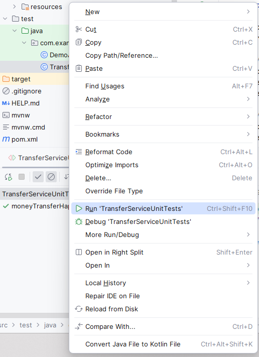
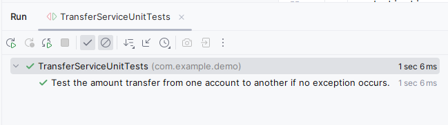

# TESTING YOUR SPRING APPS

There are primarily two kinds of tests:

- Unit tests: Focus only on an isolated piece of logic
- Integration tests: Focus on validating that multiple components correctly
  interact with each other

Navigation:

- [Implementing Unit Tests](#implementing-unit-tests)
- [Using annotations for mock dependencies](#using-annotation-for-mock-dependencies)
- [Test for an exception flow](#test-for-an-exception-flow)
- [Implementing a Spring integration test](#implementing-a-spring-integration-test)

**Regression testing** is the approach of constantly testing existing functionality to validate it still works correctly.

## IMPLEMENTING UNIT TESTS

Every test comprises three fundamental elements:

- **Assumptions**: Define inputs and manage dependencies to control the desired flow scenario. Determine necessary inputs and expected behavior of dependencies to enable the specific behavior of the tested logic.

- **Call/Execution**: Invoke or execute the logic being tested to observe and evaluate its behavior.

- **Validations**: Specify and define all expected outcomes and behaviors for the tested logic under the given conditions. Verify whether the actual behavior aligns with the expected behavior when the logic is called or executed.

> These are called call "arreange, act and assert" or "given, when and then".

In a general sense, dependencies for any method or function can be categorized into:

- **Method parameters**: External values passed as inputs to the method, influencing its behavior or output.

- **External object instances or services**: Objects or services utilized by the method, not created within it.

---

In testing the `transferMoney()` method, we have a dependency on AccountRepository's `findById()` method, but in a unit test, we shouldn't directly call this method. To handle this dependency, we use `mocks`- fake objects whose behavior we can control. By employing `mocks`, we substitute the real `AccountRepository` object with a controlled fake object. This allows us to control the behavior of `findById()` and test various executions of the `transferMoney()` method without directly invoking the actual database or repository operations. The goal is to assert that the method under test behaves as expected for different scenarios without relying on real data or external systems.

```java
@Transactional
public void transferMoney(long senderAccountId, long receiverAccountId, BigDecimal amount){

    Account sender = accountRepository.findById(senderAccountId)
            .orElseThrow(() -> new AccountNotFoundException());

    Account receiver = accountRepository.findById(receiverAccountId)
            .orElseThrow(() -> new AccountNotFoundException());

    accountRepository.changeAmount(senderAccountId, sender.getAmount().subtract(amount));
    accountRepository.changeAmount(receiverAccountId, receiver.getAmount().add(amount));

}
```

To create a `mock` we will use a method `mock()` which is provided by a dependency called `Mockito`. To make is simpler, we can import static using: `import static org.mockito.Mockito.mock`.

For creating the test cases, we will use `@Test` annotated method in the Java Files under `src/main/test`.

```java
package com.example.demo;

import com.example.demo.service.TransferService;
import org.junit.jupiter.api.Test;

import static org.mockito.Mockito.mock;

public class TransferServiceUnitTests {


    @Test
    public void moneyTransferHappyFlow(){

        //Instead of a real AccountRepository instance,
        //we create the object using a mock AccountRepository.
        AccountRepository accountRepository = mock(AccountRepository.class);
        TransferService transferService = new TransferService(accountRepository);
    }

}
```

Now we can "control" this mock object using `given()` method. In our case, we
want the AccountRepository’s `findById()` method to return a specific `Account`
instance for a given parameter value. We will also add `@DisplayName` annotation to describe the method.

```java
package com.example.demo;

import com.example.demo.model.Account;
import com.example.demo.service.TransferService;
import org.junit.jupiter.api.DisplayName;
import org.junit.jupiter.api.Test;

import java.math.BigDecimal;
import java.util.Optional;

import static org.mockito.BDDMockito.given;
import static org.mockito.Mockito.mock;

public class TransferServiceUnitTests {


    @Test
    @DisplayName("Test the amount transfer from one account to another if no exception occurs.")
    public void moneyTransferHappyFlow(){

        AccountRepository accountRepository = mock(AccountRepository.class);
        TransferService transferService = new TransferService(accountRepository);

        //create sender Account instance
        Account sender = new Account();
        sender.setId(1);
        sender.setAmount(new BigDecimal(1000));

        //create receiver Account instance
        Account destination = new Account();
        destination.setId(2);
        destination.setAmount(new BigDecimal(1000));

        //If one calls the findById() method with the sender ID parameter, then return the sender account instance
        given(accountRepository.findById(sender.getId()))
                .willReturn(Optional.of(sender));

        //If one calls the findById() method with the destination ID parameter, then return the destination account instance
        given(accountRepository.findById(destination.getId()))
                .willReturn(Optional.of(destination));

        //test transfer service
        transferService.transferMoney(sender.getId(), destination.getId(), new BigDecimal(100));

    }

}
```

Next, we need to define: What should happen when the test method is run?

To verify a mock's object's method has been called, we can use `verify()` method.

In this example, we expect `changeAmount()` method of the `accountRepository` instance to be called with

1. accountId: 1 and amount 900
2. accountId: 2 and amount 1100

So, this is what we will verify using the Mockito's `verify()` method which we can import using `import static org.mockito.Mockito.verify`.

```java
package com.example.demo;

import com.example.demo.model.Account;
import com.example.demo.service.TransferService;
import org.junit.jupiter.api.DisplayName;
import org.junit.jupiter.api.Test;

import java.math.BigDecimal;
import java.util.Optional;

import static org.mockito.BDDMockito.given;
import static org.mockito.Mockito.mock;
import static org.mockito.Mockito.verify;

public class TransferServiceUnitTests {


    @Test
    @DisplayName("Test the amount transfer from one account to another if no exception occurs.")
    public void moneyTransferHappyFlow(){

        AccountRepository accountRepository = mock(AccountRepository.class);
        TransferService transferService = new TransferService(accountRepository);

        //create sender Account instance
        Account sender = new Account();
        sender.setId(1);
        sender.setAmount(new BigDecimal(1000));

        //create receiver Account instance
        Account destination = new Account();
        destination.setId(2);
        destination.setAmount(new BigDecimal(1000));

        //If one calls the findById() method with the sender ID parameter, then return the sender account instance
        given(accountRepository.findById(sender.getId()))
                .willReturn(Optional.of(sender));

        //If one calls the findById() method with the destination ID parameter, then return the destination account instance
        given(accountRepository.findById(destination.getId()))
                .willReturn(Optional.of(destination));

        //test transfer service
        transferService.transferMoney(
                sender.getId(),
                destination.getId(),
                new BigDecimal(100)
        );

        //Verify that the changeAmount() method in the AccountRepository was called with the expected parameters.
        verify(accountRepository)
                .changeAmount(1, new BigDecimal(900));
        verify(accountRepository)
                .changeAmount(2, new BigDecimal(1100));

    }

}
```

Now, just right click on the test Java file and run it:



You will see the following test case (passed) in the output:



## USING ANNOTATION FOR MOCK DEPENDENCIES

- `@ExtendWith(MockitoExtension.class)`: Enables the use of Mockito annotations like `@Mock` and `@InjectMocks`.
- `@Mock`: Generates mock objects for dependencies (`AccountRepository`) that the `TransferService` relies on.
- `@InjectMocks`: Creates an instance of the class under test (`TransferService`) and injects the mocked dependencies (`AccountRepository`) into it.

```java
package com.example.demo;

import com.example.demo.model.Account;
import com.example.demo.service.TransferService;
import org.junit.jupiter.api.DisplayName;
import org.junit.jupiter.api.Test;
import org.junit.jupiter.api.extension.ExtendWith;
import org.mockito.InjectMocks;
import org.mockito.Mock;
import org.mockito.junit.jupiter.MockitoExtension;

import java.math.BigDecimal;
import java.util.Optional;

import static org.mockito.BDDMockito.given;
import static org.mockito.Mockito.verify;

//Enable the use of @Mock and @InjectMocks annotations
@ExtendWith(MockitoExtension.class)
public class TransferServiceUnitTests {

    @Mock
    private AccountRepository accountRepository;

    //Use the @InjectMocks to create the tested object and inject it into the class’s annotated field.
    @InjectMocks
    private TransferService transferService;

    @Test
    @DisplayName("Test the amount transfer from one account to another if no exception occurs.")
    public void moneyTransferHappyFlow(){

        //create sender Account instance
        Account sender = new Account();
        sender.setId(1);
        sender.setAmount(new BigDecimal(1000));

        //create receiver Account instance
        Account destination = new Account();
        destination.setId(2);
        destination.setAmount(new BigDecimal(1000));

        //If one calls the findById() method with the sender ID parameter, then return the sender account instance
        given(accountRepository.findById(sender.getId()))
                .willReturn(Optional.of(sender));

        //If one calls the findById() method with the destination ID parameter, then return the destination account instance
        given(accountRepository.findById(destination.getId()))
                .willReturn(Optional.of(destination));

        //test transfer service
        transferService.transferMoney(
                sender.getId(),
                destination.getId(),
                new BigDecimal(100)
        );

        //Verify that the changeAmount() method in the AccountRepository was called with the expected parameters.
        verify(accountRepository)
                .changeAmount(1, new BigDecimal(900));
        verify(accountRepository)
                .changeAmount(2, new BigDecimal(1100));

    }

}

```

## TEST FOR AN EXCEPTION FLOW

In certain cases, we except an `Exception` to be thrown. For example - if the accountId does not exist, the code would throw `AccountNotFoundException`. We can test such scenarios using `assertThrows()` method.

```java
package com.example.demo;

import com.example.demo.exception.AccountNotFoundException;
import com.example.demo.model.Account;
import com.example.demo.service.TransferService;
import org.junit.jupiter.api.DisplayName;
import org.junit.jupiter.api.Test;
import org.junit.jupiter.api.extension.ExtendWith;
import org.mockito.InjectMocks;
import org.mockito.Mock;
import org.mockito.junit.jupiter.MockitoExtension;

import java.math.BigDecimal;
import java.util.Optional;

import static org.junit.jupiter.api.Assertions.assertThrows;
import static org.mockito.ArgumentMatchers.any;
import static org.mockito.ArgumentMatchers.anyLong;
import static org.mockito.BDDMockito.given;
import static org.mockito.Mockito.never;
import static org.mockito.Mockito.verify;

@ExtendWith(MockitoExtension.class)
public class TransferServiceUnitTests {

    @Mock
    private AccountRepository accountRepository;

    @InjectMocks
    private TransferService transferService;

    @Test
    public void moneyTransferHappyFlow(){

        //create sender Account instance
        Account sender = new Account();
        sender.setId(1);
        sender.setAmount(new BigDecimal(1000));

        given(accountRepository.findById(1L))
                .willReturn(Optional.of(sender));

        //IMPORTANT:
        //We control the mock AccountRepository to return an empty Optional when the
        //findById() method is called for the destination account
        given(accountRepository.findById(2L))
                .willReturn(Optional.empty());

        //We assert that the method throws an AccountNotFoundException in the given scenario
        assertThrows(AccountNotFoundException.class, () -> transferService.transferMoney(1, 2, new BigDecimal(100)));

        //We use the verify() method with the never() conditional to assert that the
        //changeAmount() method hasn't been called.
        verify(accountRepository, never())
                .changeAmount(anyLong(), any());


    }

}
```

## IMPLEMENTING A SPRING INTEGRATION TEST

In integration testing, unlike unit testing, the focus isn't solely on isolated logic; real objects can be used instead of mocks to validate interactions between components. Mocking dependencies becomes optional in integration tests, allowing for testing the actual communication between objects rather than isolated behavior.

Integration testing can focus on:

- Object Interactions within the App:

  Testing interactions between different objects within the application helps identify issues in their collaboration, especially when modifications are made to one object.

- Framework Capabilities Integration:

  Testing an object's interaction with framework-provided capabilities helps detect issues when upgrading the framework to a new version. It ensures that the object works seamlessly with the framework's enhanced functionalities.

- App Integration with Persistence Layer (Database):

  Testing how the app integrates with its persistence layer (database) ensures quick identification of issues that might arise when updating or changing dependencies related to data persistence, such as JDBC drivers.

> In integration tests, opt for in-memory databases like H2 over real databases to maintain test independence from infrastructure, preventing potential latencies and failures due to network or infrastructure issues while focusing solely on testing the application itself.

We can use the `@MockBean` annotation to create a mock object in our Spring Boot application. This annotation is quite similar to the `@Mock` annotation we used for unit tests, but it also makes sure the mock object is added to the application context. This way, you can simply use `@Autowired`.

> The `@MockBean` annotation is a Spring Boot annotation. If we have a plain Spring app and not a Spring Boot, we won't be able to use @MockBean. However, we can still use the same approach by annotating the configuration class with `@ExtendsWith(SpringExtension.class)`.

```java
package com.example.demo;

import com.example.demo.model.Account;
import com.example.demo.service.TransferService;
import org.junit.jupiter.api.Test;
import org.springframework.beans.factory.annotation.Autowired;
import org.springframework.boot.test.context.SpringBootTest;
import org.springframework.boot.test.mock.mockito.MockBean;

import java.math.BigDecimal;
import java.util.Optional;

import static org.mockito.BDDMockito.given;
import static org.mockito.Mockito.verify;

@SpringBootTest
public class TransferServiceUnitTests {

    @MockBean //create a mock object that is also part of spring context
    private AccountRepository accountRepository;

    @Autowired //inject the real object from spring context
    private TransferService transferService;

    @Test
    void transferServiceTransferAmountTest(){

        //define the assumptions
        Account sender = new Account();
        sender.setId(1);
        sender.setAmount(new BigDecimal(1000));

        Account receiver = new Account();
        receiver.setId(2);
        receiver.setAmount(new BigDecimal(1000));

        given(accountRepository.findById(1L))
                .willReturn(Optional.of(sender));

        given(accountRepository.findById(2L))
                .willReturn(Optional.of(receiver));

        //call the method to be tested
        transferService.transferMoney(1, 2, new BigDecimal(100));

        //validate that the tested method has the expected behavior
        verify(accountRepository)
                .changeAmount(1, new BigDecimal(900));

        verify(accountRepository)
                .changeAmount(2, new BigDecimal(1100));

    }

}
```

In integration tests, although they're executed similarly to unit tests, Spring actively manages the tested objects as it does in a live application. This means that changes in Spring versions or issues with dependency injection, as well as capabilities like transactions, security, or caching, can cause test failures even if the tested code remains unchanged. It helps ensure that your methods integrate well with Spring's features as they would in the actual application.

Sample Failure Log if we had given: `verify(accountRepository)
                .changeAmount(2, new BigDecimal(1000));`

```plaintext
2023-12-31T22:20:08.869+05:30  INFO 24156 --- [           main] c.example.demo.TransferServiceUnitTests  : Started TransferServiceUnitTests in 3.128 seconds (process running for 4.219)


Argument(s) are different! Wanted:
accountRepository bean.changeAmount(
    2L,
    1000
);
-> at com.example.demo.TransferServiceUnitTests.transferServiceTransferAmountTest(TransferServiceUnitTests.java:48)
Actual invocations have different arguments at position [1]:
accountRepository bean.findById(
    1L
);
-> at com.example.demo.service.TransferService.transferMoney(TransferService.java:32)
accountRepository bean.findById(
    2L
);
-> at com.example.demo.service.TransferService.transferMoney(TransferService.java:35)
accountRepository bean.changeAmount(
    1L,
    900
);
-> at com.example.demo.service.TransferService.transferMoney(TransferService.java:38)
accountRepository bean.changeAmount(
    2L,
    1100
);
-> at com.example.demo.service.TransferService.transferMoney(TransferService.java:39)

Comparison Failure:
<Click to see difference>

Argument(s) are different! Wanted:
accountRepository bean.changeAmount(
    2L,
    1000
);
-> at com.example.demo.TransferServiceUnitTests.transferServiceTransferAmountTest(TransferServiceUnitTests.java:48)
Actual invocations have different arguments at position [1]:
accountRepository bean.findById(
    1L
);
-> at com.example.demo.service.TransferService.transferMoney(TransferService.java:32)
accountRepository bean.findById(
    2L
);
-> at com.example.demo.service.TransferService.transferMoney(TransferService.java:35)
accountRepository bean.changeAmount(
    1L,
    900
);
-> at com.example.demo.service.TransferService.transferMoney(TransferService.java:38)
accountRepository bean.changeAmount(
    2L,
    1100
);
-> at com.example.demo.service.TransferService.transferMoney(TransferService.java:39)

  at com.example.demo.TransferServiceUnitTests.transferServiceTransferAmountTest(TransferServiceUnitTests.java:48)
  at java.base/java.lang.reflect.Method.invoke(Method.java:568)
  at java.base/java.util.ArrayList.forEach(ArrayList.java:1511)
  at java.base/java.util.ArrayList.forEach(ArrayList.java:1511)

2023-12-31T22:20:08.976+05:30  INFO 24156 --- [ionShutdownHook] com.zaxxer.hikari.HikariDataSource       : HikariPool-1 - Shutdown initiated...
2023-12-31T22:20:08.979+05:30  INFO 24156 --- [ionShutdownHook] com.zaxxer.hikari.HikariDataSource       : HikariPool-1 - Shutdown completed.

Process finished with exit code -1
```
